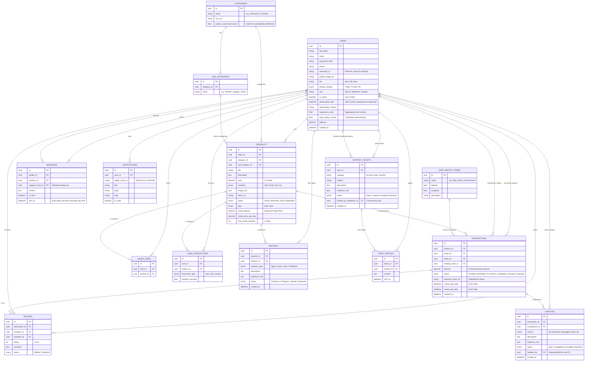

# Campus Swap - Entity Relationship Diagram (ERD)

This is the text-based ERD (Entity Relationship Diagram) for your FYP project database. 
You can copy the code block below and paste it into any Mermaid-supported renderer (like **[mermaid.live](https://mermaid.live/)**, **Notion**, **Obsidian**, or **GitHub**) to instantly generate a beautiful visual diagram!

## Mermaid ERD Code:

### 💡 How to use this for your FYP report?
1. Copy the code above starting from `erDiagram`.
2. Go to [Mermaid Live Editor](https://mermaid.live/).
3. Paste it in the left panel.
4. You will instantly see the relationships mapped out visually. You can then download it as a PNG or SVG to paste into your Word/PDF thesis document!
